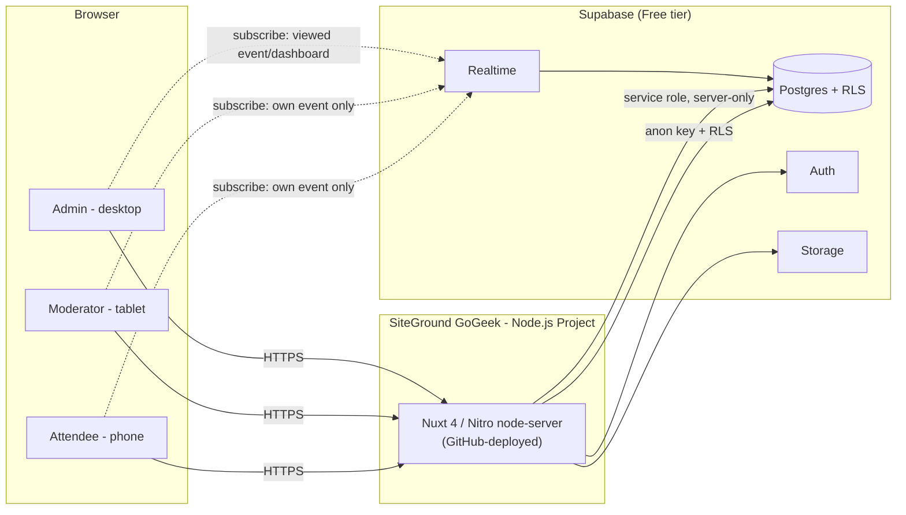

# LiveQA_1 - Project Overview

<!-- blueprint:source-hash 2b56bc82a45b7ce595e912942143a5e43f3ce2052dc8a9ae51b6a28d0cda7fa0 -->

> An original live audience Q&A app for conferences and similar events:
> attendees **Scan → Join → Ask → Vote** from their phones; moderators
> **Scan QR → Enter Password → Moderate** in real time.

## Problem

Live events need a simple way for the room to ask and upvote questions, and
for moderators to triage them, without building on top of a competitor's
proprietary code, branding, or UI. LiveQA_1 delivers that loop with the
complexity (roles, retention, free-tier limits) kept behind the scenes.

**Not in v1** (architecture shouldn't block them later): presenter/projector
screen, public embedding, authenticated attendees, billing/orgs/white-label.

## Users

| Role | Account | Auth | Scope |
|---|---|---|---|
| Administrator | Yes | Supabase Auth | Everything: events, Event Managers, global settings, audit log |
| Event Manager | Yes | Supabase Auth | Global (all events) or restricted (assigned events only) |
| Moderator | No | Per-event password | One event, event-scoped session; several moderators can share it |
| Attendee | No | Opaque device token | One event, no login |

Enforced in UI **and** server logic **and** Supabase RLS — never UI-only.

## Features

Grouped by `build-plan.md` order; the headline loop is **13/14 - live Q&A
feed + voting**.

1. **Foundation** - Supabase schema/RLS, Administrator auth, Event Manager
   permissions (global vs. restricted)
2. **Event administration** - creation wizard, tabbed management, join
   code + audience/moderator QR (+ branded signage), templates, duplication,
   branding
3. **Attendee Q&A** - join + device identity, public feed, voting, duplicate
   suggestions, search, My Questions, anonymity controls
4. **Moderation** - password auth, queue actions, bulk actions + Archive All
   Unanswered, current speaker/topic, notifications, content reporting
5. **Realtime & resilience** - scoped live sync, presence-based counts,
   reconnect + polling fallback
6. **Advanced** - replies, attachments, abuse-protection tiers
7. **Admin oversight** - live dashboard, audit log, edit history/soft
   delete, reports (CSV/HTML/PDF), backup export
8. **Production readiness** - free-tier usage guardrails, Event Readiness
   Check, accessibility (WCAG 2.2 AA), security review, load testing,
   SiteGround deployment

## Data model

- **profiles** - Administrators/Event Managers (Supabase Auth user) + role
- **events** / **event_settings** - identity + the full set of per-event
  toggles below
- **event_manager_assignments** - Event Manager ↔ event grants (global/restricted)
- **event_templates** - reusable config bundle, no attendee/Q&A data
- **attendee_types** - admin-defined dropdown values, per event
- **attendees** - opaque per-device `token` scoped to one event; backs
  votes, ownership, rate limiting, temporary bans, My Questions
- **topics** - optional speaker/topic per event; questions link to the topic
  live at submission time
- **questions** - text, `state`, `anonymous`, owner (`attendee` FK, nullable
  in public reads), `topic_id`
- **question_revisions** - admin-only edit history: original text, revised
  text, editor, timestamp
- **votes** - unique on `(attendee_id, question_id)`
- **replies** - optional, threaded to a `question_id`, independently moderated
- **attachments** - Supabase Storage object ref + `question_id`
- **content_reports** - `(attendee_id, question_id | reply_id)`, deduped
- **moderator_sessions** - event-scoped session from the password flow
- **reports** - generated export metadata
- **audit_logs** - admin/Event Manager action log (not moderator routine actions)

> Lock the `questions` state machine before Phase "Attendee Q&A":
> `pending → approved|rejected → hidden|public → answered → archived`, plus
> `soft_deleted`, with approval and public visibility tracked as
> **independent** flags (approved doesn't imply visible).
>
> `events` similarly tracks state (`draft/scheduled/live/closed/archived`)
> separately from `submissions_open` / `voting_open` / `moderator_access_enabled`.

All tables: UUID PKs, FKs, indexes on hot paths, unique constraints (slugs,
join codes, `(attendee_id, question_id)`), soft-delete columns,
`created_at`/`updated_at`. Schema lives in version-controlled migrations so a
fresh Supabase project is reproducible from the repo.

## Tech stack

- **Nuxt 4 + Vue 3 + TypeScript** - already scaffolded (`nuxt.config.ts`,
  `@nuxt/ui`)
- **Supabase** - Postgres, Realtime, Auth, Storage, RLS, DB
  functions/triggers; targets the **Free plan** at launch
- **Nitro `node-server` preset** - portable Node build output for
  SiteGround (no Vercel-specific runtime)
- **Zod** (or equivalent) - server-side input validation
- **@nuxt/ui** - component base, styled to the project's own identity
- No Vercel Functions/KV/Cron/Edge Middleware/image-storage dependence;
  scheduled maintenance mechanism (pg_cron vs. Edge Function schedule vs.
  SiteGround cron vs. app-triggered) is picked during the architecture step
- AI is optional, provider-abstracted, server-side secrets only, and may
  never auto-delete content; the app fully works with AI off

Server-side routes hold the Supabase service-role key; the browser only ever
sees the anon key plus RLS-scoped data. Moderator/attendee identity rides on
secure tokens, never a trusted frontend role flag.

## Monetization

Not in v1 - no billing, subscriptions, or paid tiers. Data/role model avoids
choices that would block adding orgs/workspaces/usage limits/Stripe later.

## UI/UX

- Own polished SaaS identity - modern, clean, rounded cards, large touch
  targets, subtle animation, accessible. **Not** a clone of
  AhaSlides/Slido/Mentimeter styling or layout.
- Device priority: attendee = phone-first, moderator = tablet-first, admin =
  desktop-first; all responsive.
- Attendee UI stays radically simpler than admin - a field existing in the
  schema is not a reason to surface it. Full attendee instructions: *"Scan
  the QR code, ask your question, and vote for questions you want answered."*
- Key routes: `/e/<slug>` (attendee), `/join` (code entry), event
  moderator URL (password gate → queue), `/admin/*` (dashboard, events,
  create event, templates, reports, event managers, audit log, settings)
- Accessibility target: **WCAG 2.2 AA** across all three surfaces.
- English-only v1; strings structured for later localization.

## Deployment

- **Host:** SiteGround **GoGeek**, as a SiteGround **Node.js Project**, on a
  dedicated subdomain, GitHub-connected auto-deploy (push → SiteGround build
  → Site Tools logs → replaces production).
- **Build:** Nitro `node-server` preset (pinned explicitly in
  `nuxt.config.ts`), npm. Node **22.x or newer**, matching Nuxt 4's own
  minimum requirement (verified against Nuxt's current docs; also
  declared in `package.json`'s `engines.node`). Build: `npm install` then
  `npm run build`, producing the standalone `.output/` directory. Start:
  `node .output/server/index.mjs`, which already respects whatever
  `PORT`/`HOST` SiteGround's Node.js Project hosting assigns (Nitro's own
  built-in behavior - no app config needed). SSL terminates in front of the
  Node process (SiteGround's own Site Tools layer), not inside it. See
  `DEPLOYMENT.md` for the full operator runbook.
- **Backend:** Supabase Free plan - ~250 total attendees, ~50-100 concurrent
  typical, several moderators, 1+ admins, possibly multiple simultaneous
  events. No artificial event-size cap; admin-visible usage guardrails +
  Event Readiness Check instead. No data migration required to upgrade to Pro.
- **Secrets:** SiteGround env-var management in production; `.env.example`
  in repo; service-role key server-side only; never commit real credentials.
- **Domain/HTTPS:** DNS + SSL + forced HTTPS; Supabase redirect URLs,
  CORS/origin, and auth redirects all point at the production URL.
- **Load target:** validated pre-launch at ~100 then ~150-200 concurrent
  clients with rapid voting/question bursts (never against a live event).

## Open questions

- **Nuxt vs. Next.js.** The source planning notes named "Nuxt 4" once and
  then referred to "Next.js/React" throughout (Vercel-avoidance language,
  `NEXT_PUBLIC_*` env vars, an `app/` directory). This overview follows
  **Nuxt 4**, matching the already-scaffolded repo, and treats every
  Next.js-shaped instruction as translated to its Nuxt/Nitro equivalent. If
  Next.js was actually intended, say so before Feature 1 - it changes the
  stack.
- Scheduled-task mechanism (pg_cron / Edge Function schedule / SiteGround
  cron / app-triggered) - decide once the concrete jobs (e.g. retention
  purge) are known.
- SiteGround-compatible PDF generation approach for branded report exports -
  decide when Report export is built.
